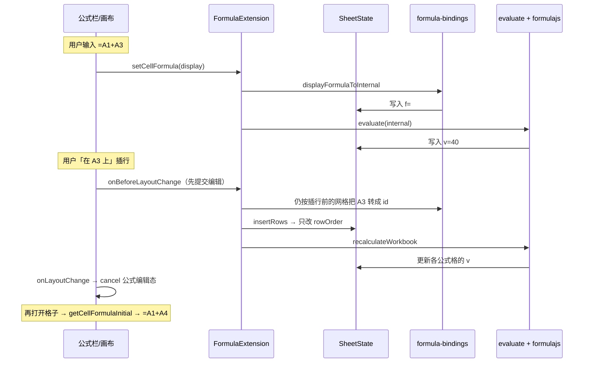

# 底层布局 + 公式同步 — 备忘（给维护者）

> 写于 **2026-05-27**。若你觉得「插行后公式为啥变 A4」是黑盒，先看本文；细节再查代码。
>
> **一句话**：格子在磁盘上按 **稳定 id** 存；屏幕上看到的 **A1、A3** 只是当前行号；公式真正记住的是 **id**，不是字母。

---

## 1. 底层数据结构（v2）

### 1.1 和旧思路的区别

| 旧（已废弃） | 新（v2） |
|-------------|----------|
| 格子的 key 像 `R2_C0`（绑在「第 2 行」上） | 格子的 key 像 `r_xxx:c_yyy`（绑在「这一行实体」上） |
| 插一行，下面行的 key 全得改 | 插一行，只改 **顺序表** `rowOrder`，cell key **不动** |

### 1.2 Y.Doc 里有什么（一张表）

```text
sheets["0"]
├── rowOrder   [ id₀, id₁, id₂, … ]   ← 第 0 行显示谁、第 1 行显示谁
├── colOrder   [ id₀, id₁, … ]
├── cells
│     "r_AAA:c_BBB" → { v, f, m, … }   ← 真正有内容的格
└── meta       rowCount / colCount
```

**读格子 (r=2, c=0)**：

```text
rowId = rowOrder[2]
colId = colOrder[0]
data  = cells[rowId + ":" + colId]
```

**插行（在显示第 2 行上方插 1 行）**：

```text
rowOrder 在下标 2 插入一个新 rowId（空行）
原来下标 2 的那一行 → 变成下标 3
cells 里 "r_旧行id:c_…" 的 key 完全不变，只是「显示行号」变了
```

所以：**数据跟着 id 走，不跟着「第几行」走。**

更细的字段说明见：[`packages/core/docs/sheet-layout-v2.md`](../packages/core/docs/sheet-layout-v2.md)

### 1.3 id 从哪来

- `rowId` / `colId`：NanoID，前缀 `r_` / `c_`（见 `packages/shared/src/axis-id.ts`）
- **不要**用 Yjs 的 `clientID` 当行 id（重连会变）

### 1.4 和 UI 的关系

- 画布、公式栏、菜单：**对外仍用 (r, c)**，用户只看到 A1、B2
- `SheetState.getCell(r,c)` 内部帮你查 `rowOrder` / `colOrder`
- 导出 Luckysheet 快照时，仍可转成 `R{r}_C{c}` 给旧格式看

### 1.5 2026-05-27 修过的一个坑

`new Sheet({ ydoc })` 时，若 `ydoc` 里**已经有** sheet，不能再塞一个空表把测试/协同数据盖掉。  
见 `packages/core/src/Sheet.ts` → `_initData` 里 `sheetsMap.size === 0` 才创建默认 sheet。

---

## 2. 公式：谁开源、谁自研

```text
┌─────────────────────────────────────────────────────────┐
│  UI：公式栏 / 画布编辑 / 插行时关编辑、先提交再改布局      │  ← 自研 (vue3 + vue3-antd)
├─────────────────────────────────────────────────────────┤
│  绑定层：A1 显示 ↔ 存盘 #r_…:c_…#、高亮、插行后变 A4     │  ← 自研 (extension-formula)
├─────────────────────────────────────────────────────────┤
│  重算：依赖登记、整表/增量 recalculate                     │  ← 自研 (engine.ts，偏轻量)
├─────────────────────────────────────────────────────────┤
│  函数：SUM、IF、AVG…                                     │  ← 开源 @formulajs/formulajs
└─────────────────────────────────────────────────────────┘
```

**存盘**：单元格 `f` 里是 **内部公式**，例如：

```text
=#r_V1StGXR8_Z5j:c_q18bcllVzsxB#+#r_另一行:c_另一列#
```

**给人看**：打开编辑 / 公式栏时用 `internalFormulaToDisplay` 转成 `=A1+A4`。

**计算**：`evaluate.ts` 把 `#…#` 换成当前格子里的数字，再调 formulajs 里的函数名。

---

## 3. 公式依赖与「插行同步」（核心黑盒拆开）

### 3.1 语义目标（和 Excel / 语雀类似）

- 你在 **A3** 写了 `30`，在 **C3** 写 `=A1+A3`
- **在 A3 上方插一行** 后：
  - `30` 仍跟着**原来那一行** → 显示到 **A4**
  - 公式仍加**同一格** → 显示成 `=A1+A4`，结果 **40**
- 不是靠「把字符串里的 A3 改成 A4」，而是 **引用绑在 rowId 上**，显示坐标随 `rowOrder` 变

### 3.2 数据流（mermaid）



### 3.3 2026-05-27 修过的「语雀式」行为

| 问题 | 原因 | 改法 |
|------|------|------|
| 插行后还显示 `=A1+A3`，高亮空 A3 | **插行之后**才提交编辑，A3 已指到新空行 | `onBeforeLayoutChange`：**先** `commitEdit` / 提交公式栏，**再** `insertRows` |
| 插行后结果不对 | 同上，错误 id 写进 `f` | 同上 |
| 测试里公式恒为 0 | `new Sheet({ ydoc })` 盖掉了已有 cells | `_initData` 仅在无 sheet 时创建空表 |

涉及文件（按调用顺序记）：

| 文件 | 干什么 |
|------|--------|
| `packages/core/src/Sheet.ts` | `notifyBeforeLayoutChange` / `notifyLayoutChange` |
| `packages/extensions/extension-formula/src/extension.ts` | 插删行列前 notifyBefore，之后 recalculate + notifyLayoutChange |
| `packages/vue3-antd/src/SpeedSheet.vue` | before：提交画布+公式栏；after：只 `formulaEdit.cancel()` |
| `packages/vue3/src/components/SheetCanvas.vue` | `endEditingForLayoutChange()` → `commitEdit()` |
| `packages/extensions/extension-formula/src/formula-bindings.ts` | A1 ↔ `#id#` |
| `packages/extensions/extension-formula/src/engine.ts` | 依赖图 + `recalculateWorkbook` |
| `packages/extensions/extension-formula/src/context.ts` | 用 rowId 取 `v` |

### 3.4 依赖图（当前实现，知道即可）

- 键：`depKey(sheetId, rowId, colId)`（不是 R2_C0）
- `registerFormulaDeps`：根据 `f` 里的 `#…#` 登记「谁依赖谁」
- 某格 `v` 变了 → `onCellChange` → `updateDependents` 重算公式格
- 插删行列 → 整表 `recalculateWorkbook`（布局大变，简单可靠）

**Undo/Redo**：见 [`docs/undo-redo-research.md`](./undo-redo-research.md)（计划 Yjs UndoManager，非 Luckysheet 快照栈）。

---

## 4. 和「整包公式引擎」的关系（可选未来）

- **formulajs**：只算函数，不管插行、不管 A1 绑定 → 你们自研层必须保留一版 adapter
- **Formualizer / HyperFormula**：整包引擎；若接入，要决定继续 **semantic id** 还是交给引擎 **A1 重写**

当前阶段：**自研绑定层 + formulajs** 够支撑「插行跟格、显示 A4」。

---

## 5. 排查清单（出问题先对这几项）

1. `cell.f` 里有没有 `#r_` / `#c_` 内部引用？（没有则插行不会跟格）
2. 插行是否走 `sheet.chain().insertRows`？（直接 `state.insertRows` 不会重算）
3. 插行时公式栏是否还在编辑？（应触发 `onBeforeLayoutChange` 先提交）
4. 打开编辑是否用 `getCellFormulaInitial`？（不要直接显示原始 `f`）
5. 协同 `ydoc` 是否被 `Sheet` 构造覆盖空表？

---

## 6. 相关链接

| 文档 | 内容 |
|------|------|
| [sheet-layout-v2.md](../packages/core/docs/sheet-layout-v2.md) | Y.Doc 字段、插行表 |
| [early-stage-no-compat.mdc](../.cursor/rules/early-stage-no-compat.mdc) | 不做旧 R_C 兼容 |
| [DEVLOG.md](./DEVLOG.md) | 按日期的开发摘要 |
